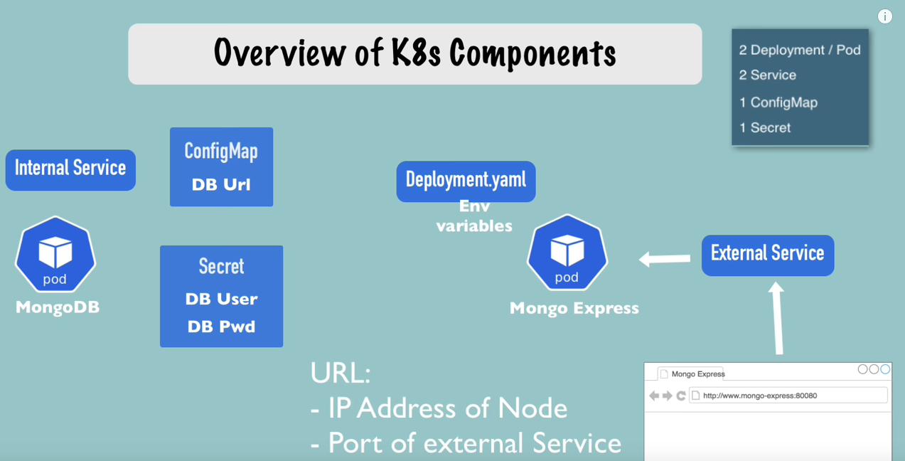

# Sample Mongo Express App deployment

## App architecture



## Request flow


## Commands

```bash
kubectl apply -f mongodb/secret.yml
kubectl apply -f mongodb/deployment.yml
kubectl apply -f mongodb/service.yml


kubectl apply -f app/config.yml
kubectl apply -f app/deployment.yml
kubectl apply -f app/service.yml

# assign public ip
minikube service mongoapp-service

```


```
|-----------|------------------|-------------|---------------------------|
| NAMESPACE |       NAME       | TARGET PORT |            URL            |
|-----------|------------------|-------------|---------------------------|
| default   | mongoapp-service |        8081 | http://192.168.49.2:30000 |
|-----------|------------------|-------------|---------------------------|
🎉  Opening service default/mongoapp-service in default browser...
```
